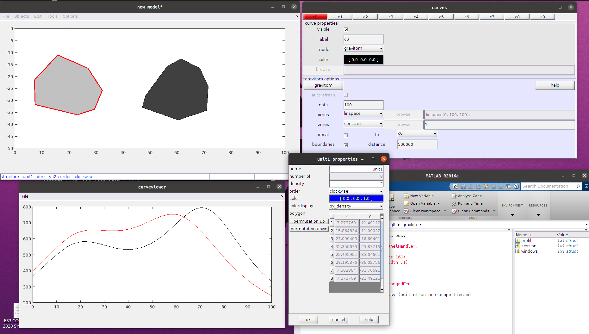

# Gravlab 
A Matlab GUI for 2d gravimetric modeling  

version 1.2  
M.Lehujeur  
23 Feb 2012  

* Create 2d polygonals structures
* Compute the gravimetric response of a profile using gravitom (F. Masson, Strasbourg university)  
  Based on Talwani et al., 1969  


### Install and launch in Matlab  
* move to gravlab path
* run install.m
```
>> install  
```
this will create the matlab file getHOME.m and set the path
* launch the gravlab GUI 
```
>> gravlab1_2
```


